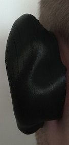
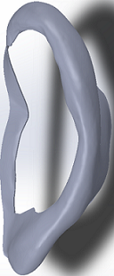

# Artificial Ear Splint (Patient-Specific, 3D Printed)

Patient-specific ear splint designed for non-surgical correction of ear deformities using additive manufacturing.

**Status:** Completed  
**Role:** Inventor • Design & Prototyping  
**Patent:** 1009882  
**Domain:** Medical Device • Additive Manufacturing • Patient-Specific Design  

---

## 📌 Overview

This project focuses on the design and prototyping of a personalized ear splint manufactured via 3D printing to enable non-surgical correction of ear deformities. The solution emphasizes patient comfort, anatomical fit, and rapid customization.
 

---

## ❗ Problem

Non-surgical correction methods often require:
- improved anatomical fit
- stable positioning over time
- patient comfort and skin-friendly contact
- fast iteration for different anatomies

---

## 🎯 Objectives

- Develop a patient-specific splint geometry
- Enable rapid customization and manufacturing via 3D printing
- Achieve comfortable skin contact and stable fixation
- Validate feasibility through prototyping and iteration
- Prepare technical material suitable for publication/patent

---

## 🛠 Design & Development

### 1) Personalization Workflow

Describe how the geometry was personalized (choose what applies):
- measurements / photos / scan-derived model
- CAD modeling workflow
- iteration cycle (fit → adjust → print)

---

### 2) CAD Design

Key design features (examples — keep what’s true):
- anatomical contouring
- fixation strategy (clip/strap/contact surfaces)
- comfort features (rounded edges, surface finish areas)
- ventilation / weight reduction patterns

🖼 *Add: CAD renders (front/side), optionally exploded view*  

  
  

---

### 3) Manufacturing (3D Printing)

**Manufacturing method:** 3D Printing  
**Process used:** (FDM/SLA/SLS)  
**Material:** (insert)  
**Key considerations:**
- dimensional accuracy and repeatability
- skin-contact comfort (surface finish, edges)
- durability during wear
- print orientation and support strategy

🖼 *Add: print setup / printed part photos*  

---

### 4) Prototyping & Iteration

Summarize your iteration steps:
- Prototype v1 → fit feedback → design change
- Prototype v2 → improved comfort/retention
- Final prototype

🖼 *Add: version timeline or side-by-side prototypes*  

---

## 📊 Results

Include the strongest “proof” you can share publicly:
- achieved patient-specific fit (qualitative)
- improved comfort/retention vs baseline approach (qualitative)
- successful prototyping and manufacturability
- readiness for dissemination (patent/publication)

🖼 *Add: final prototype on subject / final fit photo (if allowed)*  

---

## 🎥 Media

### Quick Preview

### Full Video
[▶️ Watch full video](assets/videos/ear-splint-demo.mp4)

---

## 📄 Publications / Dissemination

- Journal article(s): *(https://www.mdpi.com/2409-9279/4/3/54)*
- Conference presentations: *(https://www.researchgate.net/publication/343667495_Research_study_design_and_development_of_an_artificial_ear_splint_model_by_using_a_3D_printer)*
- Patent: **1009882**

*(If you have PDFs/posters you can share, place them in `docs/` and link here.)*

---

##  Confidentiality & Ethics

This repository is shared for portfolio purposes. Any sensitive or identifiable subject information has been removed or anonymized.
